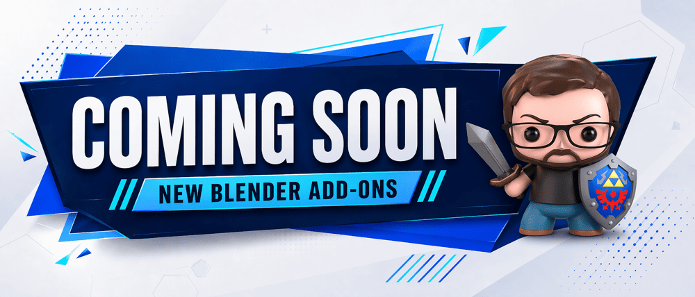
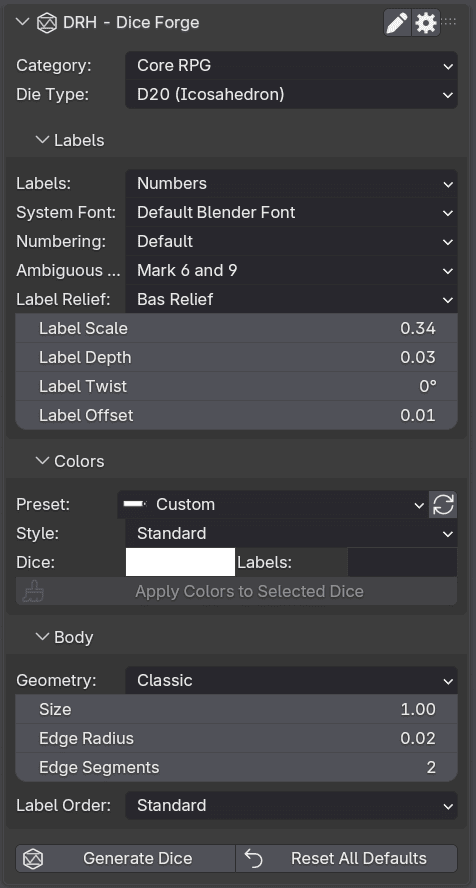

  

 

# DRH - Dice Studio Pro

### Public Support Hub · Documentation · Feedback · Pre-release Validation

**A Blender utility for generating customizable dice meshes with labels, bevels, materials, and tabletop-ready variations.**

 

**Part of the DRH Add-ons ecosystem — Blender tools, updates, and releases.**

<!--

-->

---

**DRH - Dice Studio Pro** helps Blender users create dice assets for tabletop, RPG, board game, render, prototype, and custom dice workflows.

This repository is the central public hub for support, documentation, issue tracking, compatibility feedback, and community validation before marketplace release.

---

  
<strong>📚 Table of Contents</strong>

## Menu

- [Overview](#overview)
- [Media preview](#media-preview)
- [What DRH - Dice Studio Pro does](#what-drh---dice-studio-pro-does)
- [Key features](#key-features)
- [Full feature list](#full-feature-list)
- [Who is it for?](#who-is-it-for)
- [Current status](#current-status)
- [Feedback wanted before release](#feedback-wanted-before-release)
- [Quick links](#quick-links)
- [Before you post](#before-you-post)
- [Where to post](#where-to-post)
- [Support policy](#support-policy)
- [Technical notes](#technical-notes)
- [Availability](#availability)
- [Documentation](#documentation)
- [License](#license)

---

## Overview

**DRH - Dice Studio Pro** is a Blender workflow utility designed to help users generate customizable dice assets directly inside Blender.

It is intended for tabletop creators, dice makers, D&D and RPG artists, board game creators, game artists, 3D printing users, prop designers, product visualization artists, and Blender users who need dice models for renders, asset packs, tabletop scenes, prototypes, or stylized collections.

Instead of modeling every die manually from scratch, DRH - Dice Studio Pro helps turn dice creation into a faster, more adjustable, and repeatable workflow.

## Media preview

<!--

---

### Demo video

Replace `YOUTUBE_VIDEO_ID` with your real YouTube video ID.

Example:
https://www.youtube.com/watch?v=YOUTUBE_VIDEO_ID

  
   
  Click the image to watch the demo on YouTube.

-->

<!--
### Quick demo GIF

Recommended size: 1280x720 or 960x540.

  

-->

### Early Screenshots

| Dice Generator Controls |
|---|
|  |

<!--

  
<strong>More Screenshots...</strong>

| Unit Switching | Dual Unit Display |
|---|---|
|  |  |

-->

<!--
### Visual preview

Use this section if you want one large image instead of a gallery.

  

-->

<!--
Temporary placeholder while media is not available.

Media preview coming soon.

-->

---

## What DRH - Dice Studio Pro does

DRH - Dice Studio Pro helps you create, customize, and refine dice assets directly inside Blender.

It is not only a simple dice preset tool. It is designed as a workflow helper for generating dice meshes, selecting dice types, configuring body shape, adjusting labels, choosing relief style, applying color presets, and preparing dice variations for creative or production use.

Use it to:

- Generate dice assets faster
- Create core RPG dice and specialty dice
- Configure dice body shape, bevels, and roundness
- Add labels, numbers, symbols, text, or blank faces
- Choose between engraved-style and raised-style label relief
- Adjust label scale, depth, twist, and offset
- Apply predefined or custom color presets
- Control label ordering
- Build dice variations for tabletop scenes, renders, prototypes, or asset packs

---

### Key Features

- One-click generation of customizable dice meshes directly in Blender
- Broad die coverage across core RPG, specialty, and custom generators
- Deep body-shaping controls for premium-looking dice forms
- Flexible label system for numbers, symbols, text, and blank faces
- Engraved or raised face relief for game-ready and render-ready results
- Built-in color presets plus custom color control
- Label ordering tools for standard, intercalated, or randomized numbering
- Useful for tabletop sets, board-game prototypes, asset packs, and product renders
---

  
<strong>🧩 Full feature list</strong>

## Full feature list

### Dice Generation

- Mesh-based dice generation
- In-scene dice creation workflow
- Reusable dice assets for packs, renders, and prototypes

### Core RPG Dice

- D2 [Coin]
- D2 [Roller Shape]
- D4 [Tetrahedron]
- D4 [Corner Numbers]
- D6 [Cube]
- D8 [Octahedron]
- D10 [Diamond]
- D12 [Dodecahedron]
- D20 [Icosahedron]
- D100 [50-gonal Bipyramid]

### Specialty Dice

- D1 [Rod]
- D3 [Capped Long Die]
- D5 [Triangular Gem]
- D7 [Rounded Long Die]
- D9 [Rounded Long Die]
- D11 [Rounded Long Die]
- D13 [Capped Long Die]
- D14 [Diamond]
- D15 [Capped Long Die]
- D16 [Octagonal Bipyramid]
- D17 [Capped Long Die]
- D18 [Diamond]
- D19 [Capped Long Die]
- D21 [Capped Long Die]
- D22 [Diamond]
- D23 [Capped Long Die]
- D24 [Tetrakis Hexahedron]
- D25 [Capped Long Die]
- D26 [Diamond]
- D27 [Capped Long Die]
- D28 [Tetradecagonal Bipyramid]
- D29 [Capped Long Die]
- D30 [Rhombic Triacontahedron]
- D50 [25-gonal Bipyramid]

### Custom Dice Generators

- Prism
- Antiprism
- Bipyramid
- Capped Long Die
- Pyramid
- Coin
- UV Sphere
- Octahedron
- Icosahedron
- Diamond [Bipyramid]

### Body & Geometry

- Size controls
- Height ratio controls
- Bevel radius controls
- Bevel segment controls
- Round segment controls
- Geometry family: Classic
- Geometry family: Crystal
- Geometry family: Shard
- Crystal top shaping
- Crystal bottom shaping
- Crystal base shaping
- Layout modes for face arrangement

### Labels

- Numbers
- Percentages
- Roman Numbers
- Letters
- Custom Text
- Dots
- Triangles
- Squares
- Diamonds
- Hexagons
- Stars
- Hearts
- Crosses
- Arrows
- Blank faces
- Number range modes
- Number step modes
- Custom multiple labels
- D4 corner numbering support
- Ambiguous 6/9 marking options
- Label order: Standard
- Label order: Intercalate
- Label order: Randomize
- Text presets for Yes / No
- Text presets for Yes / No / Maybe
- Text presets for Heads / Tails
- Text presets for True / False
- Text presets for Success / Fail
- Text presets for Advantage-style sets
- Custom text preset workflow

### Relief & Placement

- Engraved-style labels
- Raised-style labels
- Label scale control
- Label depth control
- Label twist control
- Label offset control
- Font selection support

### Color Workflow

- Built-in color presets
- Preset preview thumbnails
- Custom body color
- Custom label color
- Swap body and label colors
- Apply colors to selected dice

### Workflow & UI

- Reset defaults
- Settings popup
- Preferences access
- Dedicated sections for labels, colors, and body controls

---

## Who is it for?

DRH - Dice Studio Pro is designed for:

- Tabletop creators
- Dice makers
- D&D and RPG artists
- Board game creators
- Game artists
- Prop designers
- 3D printing users
- Product visualization artists
- Fantasy scene artists
- Blender asset creators
- Marketplace asset creators
- Users who need reusable dice assets, dice sets, prototypes, or tabletop props

---

## Current status

| Item | Details |
|---|---|
| **Status** | 🟣 In Development |
| **Current version** | 1.0.0 |
| **Minimum Blender version** | 4.2.0 |
| **Platforms** | Windows, macOS, Linux |
| **Release type** | In development before public marketplace release |
| **Support repository** | [DRH Dice Studio Pro Support](https://github.com/pacosalasv/DRH_Dice_Studio_Pro-Support) |

This add-on is currently in development. Compatibility feedback, usability comments, feature expectations, and workflow suggestions are welcome before public release.

---

## Feedback wanted before release

This repository is open for public feedback before marketplace release.

Feedback is especially welcome on:

- Feature usefulness
- Dice type expectations
- Label and marking workflows
- Label relief behavior
- Label ordering options
- Body shape controls
- Color preset expectations
- Tabletop and RPG use cases
- 3D printing workflow expectations
- Compatibility concerns
- Installation experience
- Documentation clarity
- Expected pricing
- Marketplace expectations

Useful feedback examples:

> “I would use this to generate a full tabletop dice set.”

> “I need specialty dice for custom board game prototypes.”

> “I need clear number labels that remain readable in renders.”

> “This should support custom symbols for fantasy dice.”

> “The relief controls should work well for both raised and engraved labels.”

> “This would be useful if the generated meshes are easy to prepare for 3D printing.”

---

## Quick links

- [Support repository](https://github.com/pacosalasv/DRH_Dice_Studio_Pro-Support)
- [Ask a question in Discussions](https://github.com/pacosalasv/DRH_Dice_Studio_Pro-Support/discussions)
- [Open a new issue](https://github.com/pacosalasv/DRH_Dice_Studio_Pro-Support/issues/new/choose)
- [Report a bug](https://github.com/pacosalasv/DRH_Dice_Studio_Pro-Support/issues/new?template=bug_report.yml)
- [Request a feature](https://github.com/pacosalasv/DRH_Dice_Studio_Pro-Support/issues/new?template=feature_request.yml)
- [Report a compatibility issue](https://github.com/pacosalasv/DRH_Dice_Studio_Pro-Support/issues/new?template=compatibility_issue.yml)

---

## Before you post

Please include as much of the following information as possible:

- Add-on version
- Blender version
- Operating system
- Installation method
- Clear steps to reproduce
- Expected result
- Actual result
- Error message, screenshot, or console output when available

For compatibility issues, please also include:

- Blender build type, if known
- Portable or installed Blender version
- Whether the issue happens with a clean Blender configuration
- Dice type involved, if relevant
- Label type involved, if relevant
- Relief type involved, if relevant
- Color preset involved, if relevant
- Whether the issue involves mesh generation, labels, relief, body controls, color presets, export, or 3D printing preparation
- Scene complexity, if relevant

---

## Use Discussions for

- Questions
- How-to topics
- Installation help
- Compatibility checks
- FAQ
- Suggestions
- Pre-release feedback
- Pricing feedback
- Workflow ideas

---

## Use Issues for

- Confirmed bugs
- Reproducible compatibility problems
- Dice generation problems
- Label or marking problems
- Relief or mesh issues
- Body control issues
- Color preset issues
- Feature requests
- Regressions
- Marketplace or listing-related problems
- Documentation errors

---

## Where to post

Open a **Discussion** for:

- General questions
- Setup help
- Workflow advice
- Suggestions
- Early feedback

Open an **Issue** for:

- Confirmed bugs
- Reproducible compatibility problems
- Dice generation failures
- Label, relief, material, color, body control, or mesh problems
- Regressions
- Feature requests
- Documentation problems

---

## Support policy

This repository is a public support hub.

Do not post:

- Private account details
- License keys
- Payment information
- Confidential production files
- Private client files
- Sensitive system information

If a private file is required to reproduce an issue, please describe the problem first and wait for further instructions.

---

## Technical notes

This add-on is source based, with:

- No obfuscation
- No binary-only content
- No external services
- No account requirements

Local system access may be used only for normal Blender workflows such as saving files, loading assets, exporting data, or using project resources when applicable.

The add-on is intended to work locally inside Blender.

---

## Availability

This add-on may be available through multiple marketplaces and storefronts after release.

This GitHub repository remains the central public location for:

- Support
- Documentation
- Issue tracking
- Compatibility reports
- Public feedback
- Release notes

---

## Documentation

- [User Manual](docs/manual/user-manual.pdf)
- [Changelog](CHANGELOG.md)

---

## License

This repository is distributed under **GPL-3.0-or-later**.

---

### DRH Add-ons

**Blender tools, updates, and releases.**

Built for clean workflows, practical utilities, and production-friendly Blender setups.

