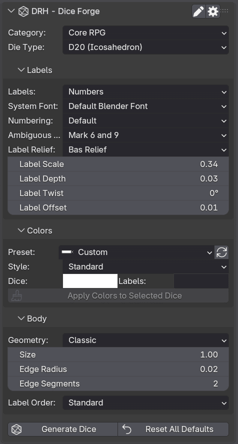

# DRH - Dice Forge

**Mesh-only dice generation for tabletop and custom polyhedral dice workflows**

   

  

---

## Overview

DRH - Dice Forge is a Blender workflow utility designed to help users generate customizable dice assets directly inside Blender.

It is intended for tabletop creators, dice makers, D&D and RPG artists, board game creators, game artists, 3D printing users, prop designers, product visualization artists, and Blender users who need dice models for renders, asset packs, tabletop scenes, prototypes, or stylized collections.

## Key features

| Capability |
|---|
| Mesh-only dice generation for tabletop and custom polyhedral dice workflows |

## Detailed features

Open detailed features

### Feature details

#### Dice Generation

- Mesh-based dice generation
- In-scene dice creation workflow
- Reusable dice assets for packs, renders, and prototypes

#### Core RPG dice
| Details |
|---|
| D2 [Coin] |
| D2 [Roller Shape] |
| D4 [Tetrahedron] |
| D4 [Corner Numbers] |
| D6 [Cube] |
| D8 [Octahedron] |
| D10 [Diamond] |
| D12 [Dodecahedron] |
| D20 [Icosahedron] |
| D100 [50-gonal Bipyramid] |

#### Specialty dice
| Details |
|---|
| D1 [Rod] |
| D3 [Capped Long Die] |
| D5 [Triangular Gem] |
| D7 [Rounded Long Die] |
| D9 [Rounded Long Die] |
| D11 [Rounded Long Die] |
| D13 [Capped Long Die] |
| D14 [Diamond] |
| D15 [Capped Long Die] |
| D16 [Octagonal Bipyramid] |
| D17 [Capped Long Die] |
| D18 [Diamond] |
| D19 [Capped Long Die] |
| D21 [Capped Long Die] |
| D22 [Diamond] |
| D23 [Capped Long Die] |
| D24 [Tetrakis Hexahedron] |
| D25 [Capped Long Die] |
| D26 [Diamond] |
| D27 [Capped Long Die] |
| D28 [Tetradecagonal Bipyramid] |
| D29 [Capped Long Die] |
| D30 [Rhombic Triacontahedron] |
| D50 [25-gonal Bipyramid] |

#### Custom dice generators
| Details |
|---|
| Prism |
| Antiprism |
| Bipyramid |
| Capped Long Die |
| Pyramid |
| Coin |
| UV Sphere |
| Octahedron |
| Icosahedron |
| Diamond [Bipyramid] |

#### Body and geometry
| Details |
|---|
| Size controls |
| Height ratio controls |
| Bevel radius controls |
| Bevel segment controls |
| Round segment controls |
| Geometry family: Classic |
| Geometry family: Crystal |
| Geometry family: Shard |
| Crystal top shaping |
| Crystal bottom shaping |
| Crystal base shaping |
| Layout modes for face arrangement |

#### Labels

| Details |
|---|
| Numbers |
| Percentages |
| Roman Numbers |
| Letters |
| Custom Text |
| Dots |
| Triangles |
| Squares |
| Diamonds |
| Hexagons |
| Stars |
| Hearts |
| Crosses |
| Arrows |
| Blank faces |
| Number range modes |
| Number step modes |
| Custom multiple labels |
| D4 corner numbering support |
| Ambiguous 6/9 marking options |
| Label order: Standard |
| Label order: Intercalate |
| Label order: Randomize |
| Text presets for Yes / No |
| Text presets for Yes / No / Maybe |
| Text presets for Heads / Tails |
| Text presets for True / False |
| Text presets for Success / Fail |
| Text presets for Advantage-style sets |
| Custom text preset workflow |

#### Relief and placement
| Details |
|---|
| Engraved-style labels |
| Raised-style labels |
| Label scale control |
| Label depth control |
| Label twist control |
| Label offset control |
| Font selection support |

#### Color workflow
| Details |
|---|
| Built-in color presets |
| Preset preview thumbnails |
| Custom body color |
| Custom label color |
| Swap body and label colors |
| Apply colors to selected dice |

#### Workflow and UI
- Reset defaults
- Settings popup
- Preferences access
- Dedicated sections for labels, colors, and body controls

## Product status

| Item | Details |
|---|---|
| Status | **Development On Hold** |
| Version | 1.0.0 |
| Blender | 4.2+ |
| Platforms | Windows, macOS, Linux |
| Availability | Development is currently on hold; no public download is promoted from this repository. |
| Distribution | Support, documentation, and development history. |
| Repository role | Documentation, support, issue tracking, compatibility feedback, and product feedback |

The repository remains available for documentation and feedback while active development is paused.

## Media

Product screenshots:

  

## Documentation and support

| Resource | Link |
|---|---|
| Support guide | [SUPPORT.md](SUPPORT.md) |
| User manual | [PDF manual](docs/manual/user-manual.pdf) |
| Repository changelog | [CHANGELOG.md](CHANGELOG.md) |
| Issues | [Open or review issues](https://github.com/pacosalasv/DRH_Dice_Studio-Support/issues) |
| Discussions | [Ask questions and share feedback](https://github.com/pacosalasv/DRH_Dice_Studio-Support/discussions) |

## Support development

Ko-fi support is optional. Contributions help fund maintenance, Blender compatibility work, documentation, testing, and continued development of free DRH tools.

  

## Ecosystem

| Destination | Link |
|---|---|
| DRH Add-ons Hub | [Catalog and roadmap](https://github.com/pacosalasv/DRH_Addons_Hub) |
| Paco Salas | DRH | [Official site](https://pacosalasv.blogspot.com/) |
| BlendKit | [DRH Blender downloads](https://www.blendkit.com/?query=author_id:205846) |
| Ko-fi | [Support development](https://ko-fi.com/pacosalasv) |

## License

See [LICENSE](LICENSE) for repository licensing terms.
